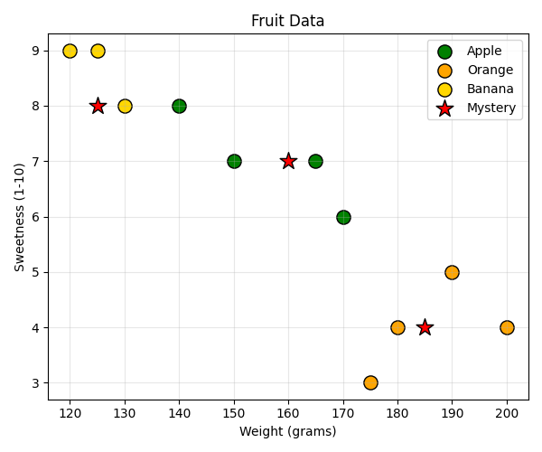
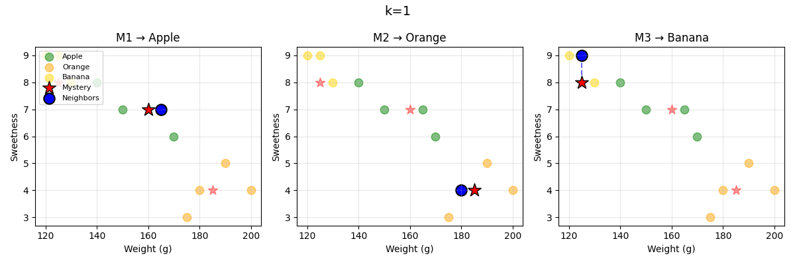
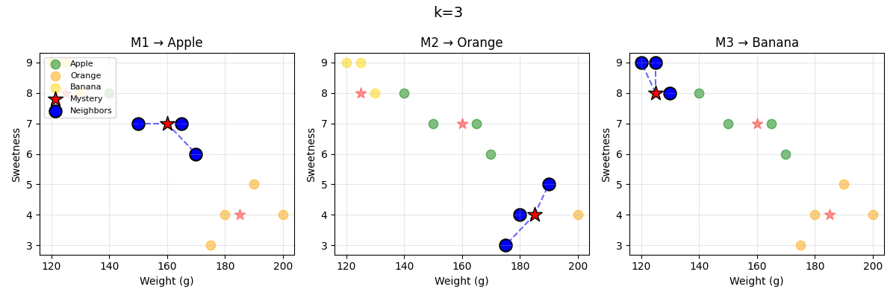
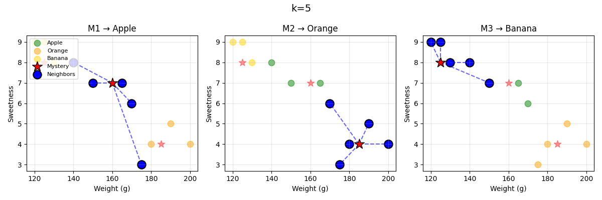

# knn-fruits

Fruit K-Nearest Neighbors (KNN) — a simple classifier that predicts fruit type (Apple, Orange, Banana) from **weight (grams)** and **sweetness (1–10)**.

## Workflow

1. **Load data** — Training points: 4 Apples, 4 Oranges, 3 Bananas; 3 mystery fruits to classify.
2. **Train KNN** — Fit a KNeighborsClassifier for `k = 1`, `3`, and `5`.
3. **Plot** — Save overview plot and per-k neighbor plots (lines show k nearest neighbors).
4. **Predict** — Classify each mystery fruit and print predictions + neighbor votes.

```
Data → Train KNN (k=1,3,5) → Plot → Predict & print
```

## Plots

**Overview: training points and mystery fruits**



**k=1 — 1 nearest neighbor**



**k=3 — 3 nearest neighbors**



**k=5 — 5 nearest neighbors**



## Run

```bash
python fruit_knn.py
```

Output: predictions for each mystery fruit at k=1, k=3, k=5, with neighbor distances and votes.
